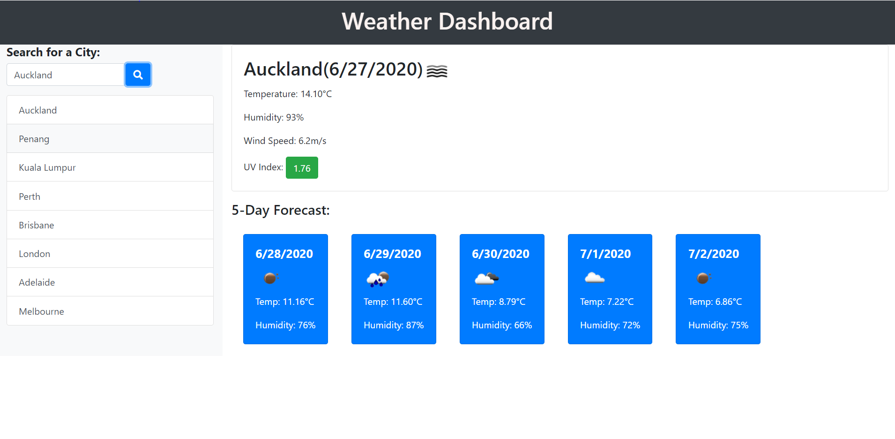

# Weather Dashboard
A simple weather dashboard that allows users to input desired city to view current weather conditions and forecast of that city for the next 5 days

## Application Launch
Please use the link [here](https://zanhong.github.io/6-weather-dashboard/)

## Description
- This application allows users to search cities and the weather results will be displayed when the search button is clicked
- Clicking the save button creates adds that city's name as a button into a list below the search bar
- The application uses local storage so that users can review the previously-searched cities by clicking on the city buttons
- Clicking the search button with an input and city list buttons will display the current weather of the desired city and the weather forecast for the next 5 days
- The UV index is color-coded based on the conditions:
  - Green: Favourable
  - Yelow: Moderate
  - Red: Severe

## Screenshot of the Application

